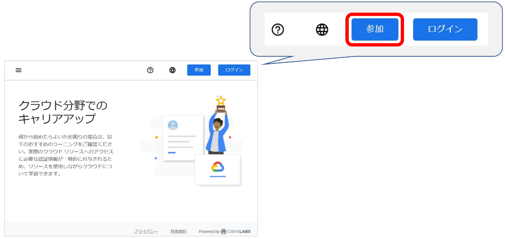
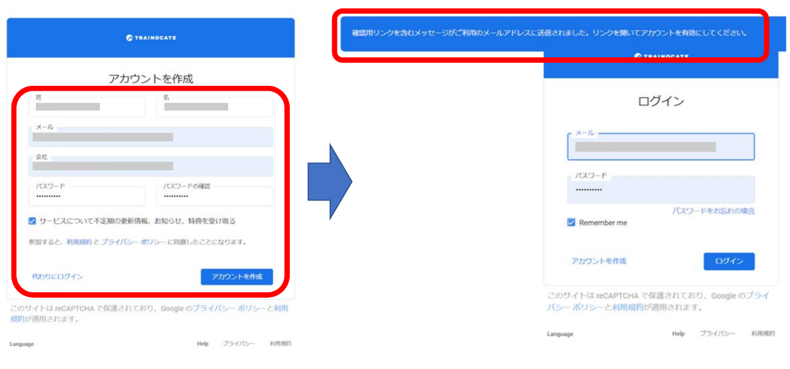
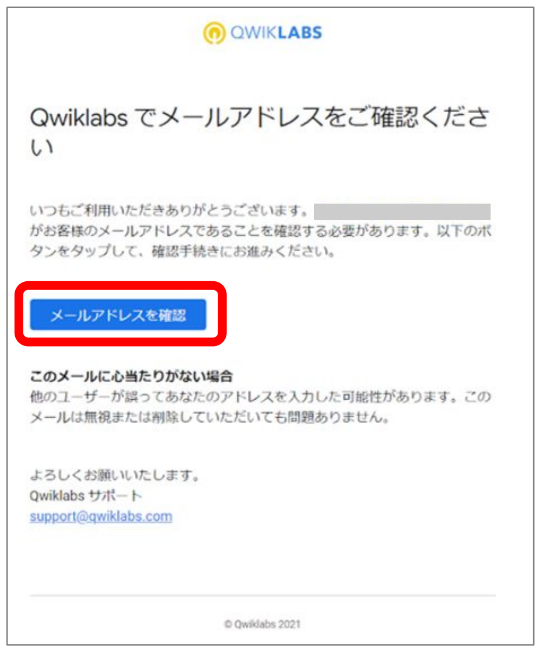

# Qwiklabs アカウント作成方法

  

## ご受講前の必須手続き

-   Google Cloud 認定トレーニングでは電子テキストとラボ (演習) に Qwiklabs というサービスを利用します。
    
-   ご受講日までに、下記の手順に従い、プライバシーポリシー及び利用規約にご同意の上、トレーニングシステム Qwiklabs のアカウントを作成ください。
    
-   Qwiklabs アカウント作成には、コース申込時の受講者メールアドレスと同一のメールアドレスをご使用ください。
    
 
  
## アカウント作成手順
1.  Chrome ブラウザで https://trainocate.qwiklabs.com/?locale=ja にアクセスします。
    
2.  画面右上の [参加] をクリックします。  

    
    
3.  表示されたフォームに各情報を入力し、利用規約同意のチェックの上、[アカウント作成] をクリックします。  
    下右図の赤枠内表記の通り、メールが送信されますのでメールの着信を確認します。  

      
 

4.  下図のようなメールが届きますので、[メールアドレスを確認] をクリックしてアカウントの作成は完了です。 
    > **Note**  
    > 上の手順後、数分で自動返信メールが届きます。  
    >    
    > From： noreply@qwiklab.com   
    > 件名 ： Qwiklabsへようこそ   
    > 
    > 自動返信メール上のQwikLabs 設定のURLは下記で表記されています。  
    > https://globalknowledge-jp.qwiklabs.com/

    
    
5.  念のため、ご受講日までに作成したアカウントで Qwiklabs にログインできることを確認してください。
